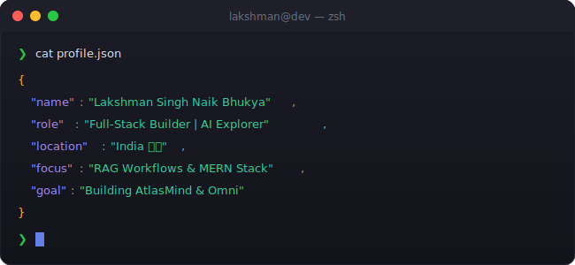

<!-- 
╔══════════════════════════════════════════════════════════════════════════════╗
║                                                                              ║
║   ██╗      █████╗ ██╗  ██╗███████╗██╗  ██╗███╗   ███╗███████╗███╗   ██╗      ║
║   ██║     ██╔══██╗██║ ██╔╝██╔════╝██║  ██║████╗ ████║██╔════╝████╗  ██║      ║
║   ██║     ███████║█████╔╝ ███████╗███████║██╔████╔██║█████╗  ██╔██╗ ██║      ║
║   ██║     ██╔══██║██╔═██╗ ╚════██║██╔══██║██║╚██╔╝██║██╔══╝  ██║╚██╗██║      ║
║   ███████╗██║  ██║██║  ██╗███████║██║  ██║██║ ╚═╝ ██║███████╗██║ ╚████║      ║
║   ╚══════╝╚═╝  ╚═╝╚═╝  ╚═╝╚══════╝╚═╝  ╚═╝╚═╝     ╚═╝╚══════╝╚═╝  ╚═══╝      ║
║                                                                              ║
║         🚀 FULL-STACK BUILDER • AI EXPLORER • CS UNDERGRAD 🚀                ║
║                                                                              ║
╚══════════════════════════════════════════════════════════════════════════════╝
-->

<div align="center">
  
  <!-- ═══════════════════════════════════════════════════════════════════════════ -->
  <!-- 🎯 ANIMATED HEADER                                                          -->
  <!-- ═══════════════════════════════════════════════════════════════════════════ -->
  
  
  
  <br/>
  
  <!-- ═══════════════════════════════════════════════════════════════════════════ -->
  <!-- 📊 PROFILE BADGES                                                           -->
  <!-- ═══════════════════════════════════════════════════════════════════════════ -->
  
  <a href="https://github.com/lakshmanbhukya">
    
  </a>
  &nbsp;
  <a href="https://github.com/lakshmanbhukya?tab=repositories">
    
  </a>
  &nbsp;
  <a href="https://github.com/lakshmanbhukya?tab=followers">
    
  </a>
  &nbsp;
  <a href="https://github.com/lakshmanbhukya">
    
  </a>
  
</div>

<br/>

<!-- ═══════════════════════════════════════════════════════════════════════════ -->
<!-- 🖥️ TERMINAL INTRO SECTION                                                   -->
<!-- ═══════════════════════════════════════════════════════════════════════════ -->

<div align="center">
  
</div>

<br/>


<br/>

<!-- ═══════════════════════════════════════════════════════════════════════════ -->
<!-- 👤 ABOUT ME SECTION                                                          -->
<!-- ═══════════════════════════════════════════════════════════════════════════ -->


<br/><br/>

<table>
<tr>
<td width="55%" valign="top">

```yaml
name: Lakshman Bhukya
located_in: India 🇮🇳
current_status: CS Undergraduate & Full-Stack Builder

areas_of_expertise:
  - 🌐 Full-Stack Engineering (MERN)
  - 🤖 AI & LLM Workflows
  - ⚙️ Backend Architecture
  - 🚀 Performance-focused Web Apps

currently_building:
  - Sentinel-EV (Agentic EV grid System)
  - MCP-style AI development workflows
  - Developer productivity tools

life_philosophy: "Understand deeply. Build practically. Improve continuously."
```

</td>
</tr>
</table>

<br/>


<br/>

<!-- ═══════════════════════════════════════════════════════════════════════════ -->
<!-- 🏆 ACHIEVEMENTS SECTION                                                     -->
<!-- ═══════════════════════════════════════════════════════════════════════════ -->


<br/><br/>

<div align="center">
  
  <!-- GitHub Trophies -->
  <a href="https://github.com/ryo-ma/github-profile-trophy">
    
  </a>
  
</div>

<br/>


<br/>

<!-- ═══════════════════════════════════════════════════════════════════════════ -->
<!-- 📊 GITHUB ANALYTICS                                                         -->
<!-- ═══════════════════════════════════════════════════════════════════════════ -->


<br/><br/>

<div align="center">
  
  <!-- GitHub Stats + Dynamic Streak in ONE ROW -->
  <a href="https://github.com/lakshmanbhukya">
    
  </a>
  &nbsp;
  <a href="https://github.com/lakshmanbhukya">
    
  </a>
  
  <br/><br/>
  
  <!-- 📊 REAL-TIME LANGUAGE USAGE WITH PROGRESS BARS -->
  <a href="https://github.com/lakshmanbhukya">
    
  </a>
  
  <br/><br/>
  
  <!-- Activity Graph -->
  <a href="https://github.com/lakshmanbhukya">
    
  </a>
  <br><br>
  <!-- Additional Stats Cards -->
  
</div>

<br/>


<br/>

<!-- ═══════════════════════════════════════════════════════════════════════════ -->
<!-- 🎮 CONTRIBUTION SHOWCASE                                                    -->
<!-- ═══════════════════════════════════════════════════════════════════════════ -->


<br/><br/>

<div align="center">
  
  <!-- Contribution Graph (Generated via GitHub Actions) -->
  <picture>
    <source media="(prefers-color-scheme: dark)" srcset="https://raw.githubusercontent.com/lakshmanbhukya/lakshmanbhukya/output/github-contribution-grid-snake-dark.svg"/>
    <source media="(prefers-color-scheme: light)" srcset="https://raw.githubusercontent.com/lakshmanbhukya/lakshmanbhukya/output/github-contribution-grid-snake.svg"/>
    
  </picture>
  
  <br/>
  
  <sub>👾 Moving snake devouring my contributions!</sub>
  
</div>


<!-- ═══════════════════════════════════════════════════════════════════════════ -->
<!-- ⚡ TECH STACK                                                               -->
<!-- ═══════════════════════════════════════════════════════════════════════════ -->


<br/><br/>

<div align="center">

<!-- 💻 LANGUAGES -->
<h4>💻 Languages</h4>
<p>
  <a href="https://developer.mozilla.org/en-US/docs/Web/JavaScript" target="_blank"></a>
  <a href="https://www.java.com/" target="_blank"></a>
  <a href="https://www.python.org/" target="_blank"></a>
</p>

<!-- 🌐 FRONTEND -->
<h4>🌐 Frontend</h4>
<p>
  <a href="https://reactjs.org/" target="_blank"></a>
  <a href="https://tailwindcss.com/" target="_blank"></a>
  <a href="https://getbootstrap.com/" target="_blank"></a>
</p>

<!-- ⚙️ BACKEND -->
<h4>⚙️ Backend</h4>
<p>
  <a href="https://nodejs.org/" target="_blank"></a>
  <a href="https://expressjs.com/" target="_blank"></a>
</p>

<!-- 🗄️ DATABASES -->
<h4>🗄️ Databases</h4>
<p>
  <a href="https://www.mongodb.com/" target="_blank"></a>
  <a href="https://www.mysql.com/" target="_blank"></a>
  <a href="https://firebase.google.com/" target="_blank"></a>
</p>

<!-- 🔧 TOOLS & PLATFORMS -->
<h4>🔧 Tools & Platforms</h4>
<p>
  <a href="https://www.docker.com/" target="_blank"></a>
  <a href="https://aws.amazon.com/" target="_blank"></a>
  <a href="https://www.jenkins.io/" target="_blank"></a>
  <a href="https://vercel.com/" target="_blank"></a>
  <a href="https://git-scm.com/" target="_blank"></a>
  <a href="https://github.com/" target="_blank"></a>
  <a href="https://code.visualstudio.com/" target="_blank"></a>
  <a href="https://www.postman.com/" target="_blank"></a>
</p>

<!-- 🤖 AI & ML -->
<h4>🤖 AI & ML</h4>
<p>
  <a href="https://ollama.com/" target="_blank"></a>
  <a href="https://huggingface.co/" target="_blank"></a>
</p>

</div>

<br/>


<br/>

<!-- ═══════════════════════════════════════════════════════════════════════════ -->
<!-- 🔥 CURRENTLY WORKING ON                                                     -->
<!-- ═══════════════════════════════════════════════════════════════════════════ -->

<div align="center">
  
### ⚡ Currently Building & Learning

<br/>

<a href="https://github.com/lakshmanbhukya">
  
</a>
&nbsp;
<a href="https://github.com/lakshmanbhukya">
  
</a>
&nbsp;
<a href="https://github.com/lakshmanbhukya">
  
</a>

</div>

<br/>


<br/>

<!-- ═══════════════════════════════════════════════════════════════════════════ -->
<!-- 🌐 CONNECT WITH ME                                                          -->
<!-- ═══════════════════════════════════════════════════════════════════════════ -->


<br/><br/>

<div align="center">
  
<a href="https://github.com/lakshmanbhukya" target="_blank">
  
</a>
&nbsp;
<a href="https://linkedin.com/in/lakshmanbhukya" target="_blank">
  
</a>
&nbsp;
<a href="mailto:lakshmannaikbhukya17@gmail.com">
  
</a>

</div>

<br/>


<br/>

<!-- ═══════════════════════════════════════════════════════════════════════════ -->
<!-- 💭 RANDOM DEV QUOTE                                                         -->
<!-- ═══════════════════════════════════════════════════════════════════════════ -->

<div align="center">
  
  ### 💭 Random Dev Quote
  
  <br/>
  
  <a href="https://github.com/lakshmanbhukya">
    
  </a>
  
</div>

<br/>


<br/>

<!-- ═══════════════════════════════════════════════════════════════════════════ -->
<!-- 🌟 FOOTER                                                                   -->
<!-- ═══════════════════════════════════════════════════════════════════════════ -->

<div align="center">
  
  
  
  <br/><br/>
  
  
  
</div>

<!-- ═══════════════════════════════════════════════════════════════════════════ -->
<!-- 📝 END OF README                                                            -->
<!-- ═══════════════════════════════════════════════════════════════════════════ -->
