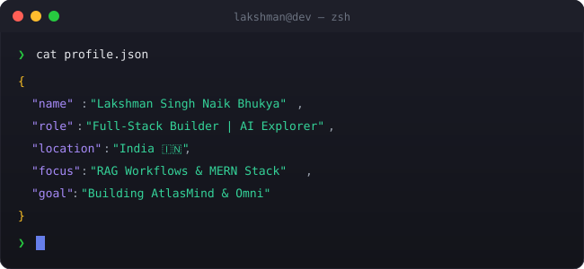

<!-- 
╔══════════════════════════════════════════════════════════════════════════════╗
║                                                                              ║
║   ██╗      █████╗ ██╗  ██╗███████╗██╗  ██╗███╗   ███╗███████╗███╗   ██╗      ║
║   ██║     ██╔══██╗██║ ██╔╝██╔════╝██║  ██║████╗ ████║██╔════╝████╗  ██║      ║
║   ██║     ███████║█████╔╝ ███████╗███████║██╔████╔██║█████╗  ██╔██╗ ██║      ║
║   ██║     ██╔══██║██╔═██╗ ╚════██║██╔══██║██║╚██╔╝██║██╔══╝  ██║╚██╗██║      ║
║   ███████╗██║  ██║██║  ██╗███████║██║  ██║██║ ╚═╝ ██║███████╗██║ ╚████║      ║
║   ╚══════╝╚═╝  ╚═╝╚═╝  ╚═╝╚══════╝╚═╝  ╚═╝╚═╝     ╚═╝╚══════╝╚═╝  ╚═══╝      ║
║                                                                              ║
║         🚀 FULL-STACK BUILDER • AI EXPLORER • CS UNDERGRAD 🚀                ║
║                                                                              ║
╚══════════════════════════════════════════════════════════════════════════════╝
-->

  
  <!-- ═══════════════════════════════════════════════════════════════════════════ -->
  <!-- 🎯 ANIMATED HEADER                                                          -->
  <!-- ═══════════════════════════════════════════════════════════════════════════ -->
  
  
  
   
  
  <!-- ═══════════════════════════════════════════════════════════════════════════ -->
  <!-- 📊 PROFILE BADGES                                                           -->
  <!-- ═══════════════════════════════════════════════════════════════════════════ -->
  
  
  &nbsp;
  
  &nbsp;
  
  &nbsp;
  
  

 

<!-- ═══════════════════════════════════════════════════════════════════════════ -->
<!-- 🖥️ TERMINAL INTRO SECTION                                                   -->
<!-- ═══════════════════════════════════════════════════════════════════════════ -->

  

 

 

<!-- ═══════════════════════════════════════════════════════════════════════════ -->
<!-- 🏆 ACHIEVEMENTS SECTION                                                     -->
<!-- ═══════════════════════════════════════════════════════════════════════════ -->

  

  
  <!-- Featured Hackathon Achievement -->
  <table width="85%" align="center">
    <tr>
      <td align="left">
        <h3>🥈 1st Runner-Up — Hack-N-Go (MongoDB & TheSmartBridge)</h3>
        

          Secured <b>1st Runner-Up</b> at <b>Hack-N-Go</b>, a national-level hackathon powered by <b>TheSmartBridge & MongoDB</b>, competing solo among <b>10,000+ participants</b> to reach the top 10 finalists.
        

        

          💡 <b>Featured Project: <a href="https://github.com/lakshmanbhukya/AtlasMind">AtlasMind</a></b> — AI-Powered Natural Language & Voice Query Platform converting user queries into optimized MongoDB queries in &lt;200ms using LLMs, few-shot RAG retrieval, and strict read-only backend guardrails.
        

      </td>
    </tr>
  </table>

   

  <!-- GitHub Trophies -->
  
  

 

 

<!-- ═══════════════════════════════════════════════════════════════════════════ -->
<!-- 📊 GITHUB ANALYTICS                                                         -->
<!-- ═══════════════════════════════════════════════════════════════════════════ -->

  

  
  <!-- GitHub Stats + Dynamic Streak in ONE ROW -->
  
  &nbsp;
   

 

 

<!-- ═══════════════════════════════════════════════════════════════════════════ -->
<!-- 🎮 CONTRIBUTION SHOWCASE                                                    -->
<!-- ═══════════════════════════════════════════════════════════════════════════ -->

  

<!-- 

  
  <!-- Contribution Graph (Generated via GitHub Actions) -->
  <picture>
    <source media="(prefers-color-scheme: dark)" srcset="https://raw.githubusercontent.com/lakshmanbhukya/lakshmanbhukya/output/github-contribution-grid-snake-dark.svg"/>
    <source media="(prefers-color-scheme: light)" srcset="https://raw.githubusercontent.com/lakshmanbhukya/lakshmanbhukya/output/github-contribution-grid-snake.svg"/>
    
  </picture>
  
   
  
  👾 Moving snake devouring my contributions!
  

 -->

<!-- ═══════════════════════════════════════════════════════════════════════════ -->
<!-- 🚀 TECH STACK (ALIGNED WITH RESUME) -->

  

<!-- LANGUAGES -->
<h3>⌨️ Languages</h3>

  

<!-- BACKEND -->
<h3>⚙️ Backend</h3>

  

<!-- FRONTEND -->
<h3>🎨 Frontend</h3>

  

<!-- AI & CLOUD -->
<h3>☁️ AI & Cloud</h3>

  

<!-- DATABASES -->
<h3>🗄️ Databases</h3>

  

<!-- DEVOPS & TOOLS -->
<h3>🛠️ DevOps & Tools</h3>

 

 

<!-- ═══════════════════════════════════════════════════════════════════════════ -->
<!-- 🔥 CURRENTLY WORKING ON                                                     -->
<!-- ═══════════════════════════════════════════════════════════════════════════ -->

  
### ⚡ Currently Building & Learning

 

&nbsp;

&nbsp;

 

 

<!-- ═══════════════════════════════════════════════════════════════════════════ -->
<!-- 🌐 CONNECT WITH ME                                                          -->
<!-- ═══════════════════════════════════════════════════════════════════════════ -->

  

  

&nbsp;

&nbsp;

&nbsp;

  
    
  
  
  

<!-- ═══════════════════════════════════════════════════════════════════════════ -->
<!-- 📝 END OF README                                                            -->
<!-- ═══════════════════════════════════════════════════════════════════════════ -->
