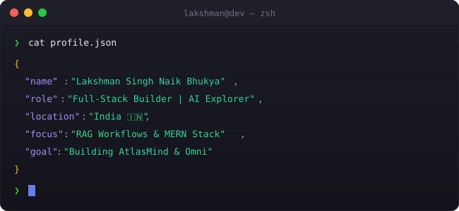

<!-- 
╔══════════════════════════════════════════════════════════════════════════════╗
║                                                                              ║
║   ██╗      █████╗ ██╗  ██╗███████╗██╗  ██╗███╗   ███╗███████╗███╗   ██╗      ║
║   ██║     ██╔══██╗██║ ██╔╝██╔════╝██║  ██║████╗ ████║██╔════╝████╗  ██║      ║
║   ██║     ███████║█████╔╝ ███████╗███████║██╔████╔██║█████╗  ██╔██╗ ██║      ║
║   ██║     ██╔══██║██╔═██╗ ╚════██║██╔══██║██║╚██╔╝██║██╔══╝  ██║╚██╗██║      ║
║   ███████╗██║  ██║██║  ██╗███████║██║  ██║██║ ╚═╝ ██║███████╗██║ ╚████║      ║
║   ╚══════╝╚═╝  ╚═╝╚═╝  ╚═╝╚══════╝╚═╝  ╚═╝╚═╝     ╚═╝╚══════╝╚═╝  ╚═══╝      ║
║                                                                              ║
║         🚀 FULL-STACK BUILDER • AI EXPLORER • CS UNDERGRAD 🚀                ║
║                                                                              ║
╚══════════════════════════════════════════════════════════════════════════════╝
-->

  
  <!-- ═══════════════════════════════════════════════════════════════════════════ -->
  <!-- 🎯 ANIMATED HEADER                                                          -->
  <!-- ═══════════════════════════════════════════════════════════════════════════ -->
  
  
  
   
  
  <!-- ═══════════════════════════════════════════════════════════════════════════ -->
  <!-- 📊 PROFILE BADGES                                                           -->
  <!-- ═══════════════════════════════════════════════════════════════════════════ -->
  
  
  &nbsp;
  
  &nbsp;
  
  &nbsp;
  
  

 

<!-- ═══════════════════════════════════════════════════════════════════════════ -->
<!-- 🖥️ TERMINAL INTRO SECTION                                                   -->
<!-- ═══════════════════════════════════════════════════════════════════════════ -->

  

 

 

<!-- ═══════════════════════════════════════════════════════════════════════════ -->
<!-- 🏆 ACHIEVEMENTS SECTION                                                     -->
<!-- ═══════════════════════════════════════════════════════════════════════════ -->

  

  
  <!-- Featured Hackathon Achievement -->

  <!-- GitHub Trophies -->
  
  

 

 

<!-- ═══════════════════════════════════════════════════════════════════════════ -->
<!-- 🚀 TECH STACK                                                               -->
<!-- ═══════════════════════════════════════════════════════════════════════════ -->

  

  

 

 

<!-- ═══════════════════════════════════════════════════════════════════════════ -->
<!-- 🌐 CONNECT WITH ME                                                          -->
<!-- ═══════════════════════════════════════════════════════════════════════════ -->

  

  
  
  &nbsp;
  
  &nbsp;
  
  &nbsp;
  

  

<!-- ═══════════════════════════════════════════════════════════════════════════ -->
<!-- 🌊 FOOTER                                                                   -->
<!-- ═══════════════════════════════════════════════════════════════════════════ -->

  

<!-- ═══════════════════════════════════════════════════════════════════════════ -->
<!-- 📝 END OF README                                                            -->
<!-- ═══════════════════════════════════════════════════════════════════════════ -->
